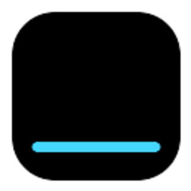

<p align="center">
  
</p>

<h1 align="center">ReelNX</h1>

ReelNX is an independent open-source media client for Nintendo Switch homebrew with support for the Stremio Addon Protocol.

The project is derived from StreamFinEX, StreamFin, and Switchfin, but it is not an official Stremio application and does not present itself as one. It ships with no media content and no addon. What you browse or play is determined by compatible addons you configure.

This project is not affiliated with or endorsed by Stremio or Nintendo.

## Status

ReelNX is in early development. The current milestone focuses on an independent build identity, isolated configuration, and preserving the existing StreamFinEX functionality while the architecture evolves.

## Features

- Controller-first Nintendo Switch homebrew UI.
- Catalog browsing through protocol-compatible metadata/catalog addons.
- Cinemeta and Kitsu-based browsing paths inherited from StreamFinEX.
- Search, Library, Continue Watching, title details, seasons, episodes, stream picker, MPV playback, resume playback, external subtitles, and poster provider support.
- TLS verification remains enabled for HTTPS requests.

## Installation

1. Build or download `ReelNX.nro`.
2. Copy it to `sdmc:/switch/ReelNX/ReelNX.nro`.
3. Launch ReelNX from the Homebrew Menu.

Use title override rather than applet mode when possible so MPV has enough memory.

## Configuration

ReelNX uses its own configuration directory:

```text
sdmc:/config/ReelNX/
```

This is intentionally separate from StreamFinEX/StreamFin/Switchfin so the apps can coexist on the same SD card during testing.

Manual addon configuration can be provided with:

```text
sdmc:/switch/ReelNX/reelnx-addon.txt
```

Supported lines:

```text
https://your-stream-addon.example.com/...
rpdb=YOUR_RPDB_KEY
poster=https://example.com/{imdbId}.jpg
subtitles=https://your-subtitles-addon.example.com/...
```

The QR account flow remains available for compatible addon synchronization.

See `docs/CONFIGURATION.md` for the full runtime path and addon import behavior.

## Controls

| Context | Button | Action |
|---|---|---|
| Home | A | Select focused item |
| Home | X | Add/remove from Library where available |
| Home | Y | Search |
| Home | - | Addon/account setup |
| Detail | A | Watch or Episodes |
| Detail | X | Add/remove from Library |
| Stream picker | A | Play |
| Stream picker | X | Toggle filter |
| Stream picker | Y | Toggle sort |
| Player | L / R | Seek back / forward |
| Player | X | Lock screen |
| Player | - | Stream info |
| Player | + | Player settings |

The UX roadmap includes a global `+` menu and a shared contextual action system for every screen.

## Building

Nintendo Switch builds require devkitPro/devkitA64/libnx and the existing Switch portlibs used by the inherited project.

```bash
export DEVKITPRO=/opt/devkitpro
DEVKITPRO=/opt/devkitpro cmake -B build_switch_reelnx -G Ninja \
  -DPLATFORM_SWITCH=ON \
  -DBUILTIN_NSP=OFF \
  -DBOREALIS_USE_DEKO3D=ON
DEVKITPRO=/opt/devkitpro cmake --build build_switch_reelnx --target ReelNX.nro -j2
```

The generated file is:

```text
build_switch_reelnx/ReelNX.nro
```

Before publishing a release, follow `docs/RELEASE_CHECKLIST.md`.

Desktop builds are useful for quick compile checks:

```bash
cmake -B build-reelnx -DPLATFORM_DESKTOP=ON
cmake --build build-reelnx --target ReelNX -j2
```

## Architecture Overview

Current code is still close to StreamFinEX. The long-term direction is incremental migration toward:

```text
ReelNX
├── UI
├── Addon Manager
├── Stream Aggregator
├── Cache
├── Network
└── Player / libmpv
```

Phase 1 intentionally avoids large refactors. The first goal is a stable independent `ReelNX.nro` with isolated config and neutral branding.

## Credits

ReelNX builds on substantial upstream work:

- StreamFinEX: fork base for the current Stremio Addon Protocol integration and Switch-oriented media UX work.
- StreamFin: Stremio-on-Switch base project.
- Switchfin: original native media client foundation, Borealis integration, player integration, and build system heritage.
- Borealis: controller-friendly UI framework.
- libnx and devkitPro: Nintendo Switch homebrew toolchain and userland APIs.
- libmpv and FFmpeg: playback stack.
- curl, mbedTLS/OpenSSL, libssh2, dav1d, libwebp, lunasvg, nlohmann/json, fmt, stb_image and other dependencies listed in `THIRD_PARTY.md` or vendored license files.
- Stremio: open addon protocol documentation and public addon ecosystem. ReelNX is not affiliated with Stremio.

## License

ReelNX keeps the inherited Apache License 2.0 licensing. See `LICENSE` and `THIRD_PARTY.md`.

Do not remove upstream copyright notices or license headers from reused source files.
